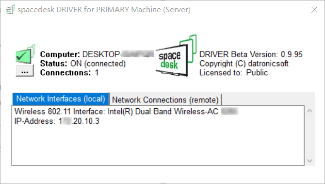
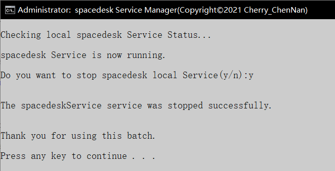
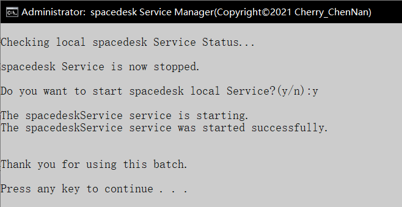

# spacedesk_Service_Manager

[中文](readme_cn.md)

A batch file to manage spacedesk Service. Spacedesk is a multi monitor application for windows but don't have an exit button.

There are so many multi monitor application you can find for your Windows、iOS、Android, so did I.

And then I fond spacedesk! (You can find more info here: <https://spacedesk.net/>)

It's small, free, nice performance. It can use for Android, iOS, Windows. It's good enough for me.

But soon I realized it has no exit button! 

So it stays in my Windows process tasks always.

After I killed it on my process task, I couldn't open it when I wanted to use it.

It's so annoying, isn't it!

So I write this batch file, that I can manage the Spacedesk Service easily.

[Download Batch File](Spacedesk_Service_Manager.bat) 

