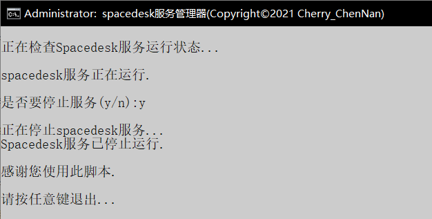
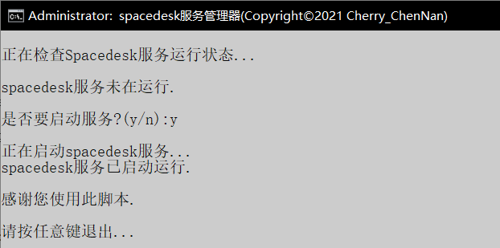

# spacedesk 服务管理器

[English](README.md) 

项目包含一个批处理文件，用来管理spacedesk服务。Spacedesk是一个用于Windows的多显示器应用程序，但没有一个退出按钮。

你可以为你的Windows、iOS、Android找到很多的多显示器应用程序，我也找到了。

然后我就喜欢上了spacedesk! (你可以在这里找到更多信息：<https://spacedesk.net/>)

它小巧、免费、性能良好。它可以用于Android、iOS和Windows。这对我来说足够好了。

但很快我发现它没有退出按钮！

所以它总是停留在我的Windows进程任务中。

当我在进程任务中杀死它后，当我想使用它时，我却又无法打开它。

这真是太烦人了，不是吗？

所以我写了这个批处理文件，以便我可以轻松地管理Spacedesk服务。

[Download Batch File](Spacedesk服务管理器.bat) 